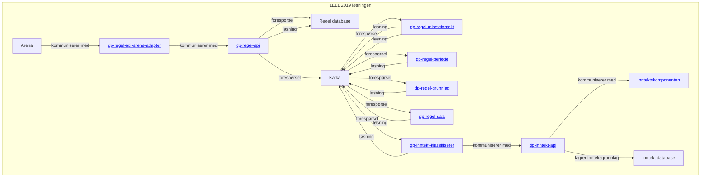

# Systemer i bruk i LEL1 2019 løsningen

## Flytdiagram

```mermaid
graph TD
subgraph "LEL1 2019 løsningen"
Arena["Arena"]
dp-regel-api-arena-adapter[<a href='https://github.com/navikt/dp-regel-api-arena-adapter'>dp-regel-api-arena-adapter</a>]
dp-regel-api[<a href='https://github.com/navikt/dp-regel-api'>dp-regel-api</a>]
regelDb["Regel database"]
dp-inntekt-api[<a href='https://github.com/navikt/dp-inntekt-api'>dp-inntekt-api</a>]
dp-inntekt-klassifiserer[<a href='https://github.com/navikt/dp-inntekt-klassifiserer'>dp-inntekt-klassifiserer</a>]
inntektDB["Inntekt database"]
dp-inntekt-minsteinntekt[<a href='https://github.com/navikt/dp-inntekt-minsteinntekt'>dp-regel-minsteinntekt</a>]
dp-inntekt-periode[<a href='https://github.com/navikt/dp-regel-periode'>dp-regel-periode</a>]
dp-inntekt-sats[<a href='https://github.com/navikt/dp-regel-sats'>dp-regel-sats</a>]
dp-inntekt-grunnlag[<a href='https://github.com/navikt/dp-regel-grunnlag'>dp-regel-grunnlag</a>]
Kafka["Kafka"]
Inntektskomponenten[<a href='https://github.com/navikt/https://github.com/navikt/inntektskomponenten'>Inntektskomponenten</a>]
end

Arena -->|kommuniserer med| dp-regel-api-arena-adapter
dp-regel-api-arena-adapter -->|kommuniserer med| dp-regel-api
dp-regel-api -->|forespørsel| regelDb
dp-regel-api -->|forespørsel| Kafka
Kafka -->|forespørsel| dp-inntekt-minsteinntekt
Kafka -->|forespørsel| dp-inntekt-periode
Kafka -->|forespørsel| dp-inntekt-grunnlag
Kafka -->|forespørsel| dp-inntekt-sats
Kafka -->|forespørsel| dp-inntekt-klassifiserer
dp-inntekt-klassifiserer -->|kommuniserer med| dp-inntekt-api
dp-inntekt-api -->|kommuniserer med| Inntektskomponenten
dp-inntekt-api -->|lagrer innteksgrunnlag| inntektDB
dp-inntekt-klassifiserer -->|løsning|Kafka
dp-inntekt-grunnlag -->|løsning|Kafka
dp-inntekt-periode -->|løsning|Kafka
dp-inntekt-sats -->|løsning|Kafka
dp-inntekt-minsteinntekt -->|løsning|Kafka
dp-inntekt-minsteinntekt -->|løsning|Kafka
dp-regel-api -->|løsning| regelDb
```

## Dokumentasjon

- [Presentasjon av LEL1 2019 løsningen](DigitaleDagpengerArk.pptx)

