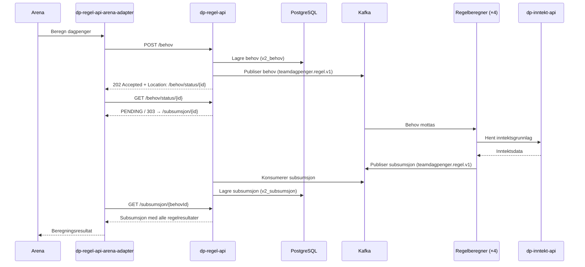
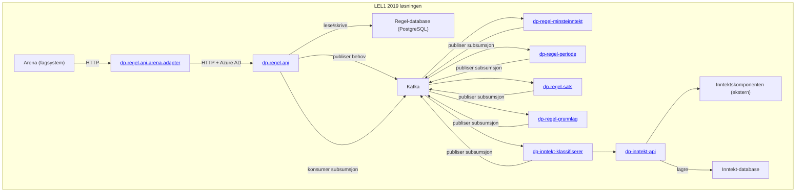

# dp-regel-api — systemdokumentasjon

## Hva gjør tjenesten?

`dp-regel-api` er REST API-inngangspunktet for kjøring av dagpengeregler i LEL1 2019-løsningen.
Tjenesten mottar beregningsbehov fra `dp-regel-api-arena-adapter`, publiserer dem til Kafka
og venter på at spesialiserte regelberegnings-tjenester returnerer subsumsjoner.
Resultater lagres i PostgreSQL og kan hentes av konsumenter.

De fire reglene som beregnes er:
- **Minsteinntekt** — oppfyller søker kravet til minste arbeidsinntekt?
- **Periode** — hvor mange uker har søker rett til dagpenger?
- **Sats** — hva er dagpengesatsen (dagsats)?
- **Grunnlag** — hva er beregningsgrunnlaget?

---

## Systemflyt



## Systemkart



---

## Vilkårsprøving og vedtakssammensetning

Beregningen av en dagpengerettighet er sammensatt av fire uavhengige regler. Alle fire kjøres parallelt
og lagres samlet i én subsumsjon. Arena bruker samtlige resultater som grunnlag for vedtaket.

### Minsteinntekt

Sjekker om søker oppfyller kravet til arbeidsinntekt etter folketrygdloven § 4-4.

| Input | Beskrivelse |
|-------|-------------|
| `beregningsDato` | Referansedato for inntektsoppslag |
| `harAvtjentVerneplikt` | Gir fritak fra minsteinntektskravet |
| `oppfyllerKravTilFangstOgFisk` | Aktiverer særregler for fiskere |
| `lærling` | Lærling-unntak |
| `bruktInntektsPeriode` | Overstyrer hvilken inntektsperiode som brukes |

**Resultatfelt:** `oppfyllerMinsteinntekt` (boolean), `beregningsRegel` (hvilken regel som slo til), `minsteinntektInntektsPerioder`

### Periode

Beregner antall uker søker har rett på dagpenger (52 eller 104 uker) basert på inntektsnivå.

| Input | Beskrivelse |
|-------|-------------|
| `beregningsDato` | Referansedato |
| `inntektsId` | Referanse til allerede klassifisert inntekt (valgfritt) |

**Resultatfelt:** `periodeAntallUker` (52 eller 104)

### Grunnlag

Beregner dagpengegrunnlaget — den inntekten som brukes som basis for dagsatsen.
Bruker høyeste av: inntekt siste 12 måneder × 3 eller inntekt siste 36 måneder.

| Input | Beskrivelse |
|-------|-------------|
| `manueltGrunnlag` | Overstyrer beregnet grunnlag (saksbehandler-input) |
| `forrigeGrunnlag` | Grunnlag fra forrige vedtak (gjenopptak) |
| `beregningsDato` | Referansedato |

**Resultatfelt:** `avkortetGrunnlag`, `uavkortetGrunnlag`, `beregningsRegel`, `grunnlagInntektsPerioder`

### Sats

Beregner dagpengesatsen (dagsats og ukesats) basert på grunnlag, grunnbeløp og antall barn.

| Input | Beskrivelse |
|-------|-------------|
| `grunnlagResultat.avkortetGrunnlag` | Fra grunnlagsberegningen |
| `antallBarn` | Antall barn under 18 år (barnetillegg) |
| `beregningsDato` | Brukes til å finne riktig G-verdi |

**Resultatfelt:** `dagsats`, `ukesats`, `grunnbeløpBrukt`, `grunnlagForDagsats`

### Beregningsscenarioer

Avhengig av hvilke felt som er tilstede i behovet, velges ett av disse scenarioene:

| Scenario | Trigger | Resultat |
|----------|---------|---------|
| **Full beregning** | Alle fire regler har resultater | Komplett subsumsjon med alle felt |
| **Manuelt grunnlag** | `manueltGrunnlag` er satt — grunnlag/sats beregnes, resten hoppes over | Kun `grunnlagResultat` + `satsResultat` |
| **Forrige grunnlag** | `forrigeGrunnlag` er satt — gjenopptak | Kun `grunnlagResultat` + `satsResultat` |
| **Problem** | En eller flere regler feilet | Subsumsjon med `problem`-felt, ingen regelresultater |

---

## Fullstendig kontrollspor

Fra innkommende beregningsbehov til utbetaling:

```
1. Arena           → POST /behov til dp-regel-api-arena-adapter
2. Arena-adapter   → POST /behov til dp-regel-api (Azure AD)
3. dp-regel-api    → Lagrer behov i v2_behov (PostgreSQL)
4. dp-regel-api    → Publiserer behov på Kafka (teamdagpenger.regel.v1)
5. Regelberegnere  → Henter inntekt fra dp-inntekt-api, beregner, publiserer subsumsjon
6. dp-regel-api    → Konsumerer subsumsjon fra Kafka, lagrer i v2_subsumsjon
7. Arena-adapter   → Poller GET /behov/status/{id} til 303 → GET /subsumsjon/{id}
8. Arena-adapter   → Sender subsumsjon tilbake til Arena som beregningsresultat
9. Arena           → Oppretter vedtak (NY/DAGP) og sender til utbetaling (OS/UR)
10. Arena          → Publiserer brukt-signal på Kafka (teamdagpenger.subsumsjonbrukt.v1)
11. dp-regel-api   → Konsumerer brukt-signal, merker subsumsjon i v2_subsumsjon_brukt
```

**Sporbarhet per steg:**

| Steg | Spores via | Audit |
|------|-----------|-------|
| Mottak av behov | `v2_behov.created` + `behovId` i logger | Applikasjonslogg |
| Kafka-publisering | `system_started` i Kafka-melding | Kafka topic retention |
| Regelberegning | `subsumsjonsId` per regel | Applikasjonslogg i regelberegnere |
| Lagring i DB | `v2_subsumsjon.created` | pgAudit (write-logging aktivert i prod) |
| Brukt i vedtak | `v2_subsumsjon_brukt.arena_ts` | pgAudit + `arena_ts` |

> pgAudit er aktivert i prod med `pgaudit.log = write,ddl,role` — alle INSERT/UPDATE/DELETE logges til Cloud Logging.

---

## Tilgangskontroll og roller

### Systemtilgang (inbound)

| Klient | Autentisering | Tilgang |
|--------|--------------|---------|
| `dp-regel-api-arena-adapter` (prod-fss) | Azure AD client_credentials | Alle forretningsendepunkter (`/behov`, `/subsumsjon`, `/lovverk`) |
| Prometheus (Nais-intern) | Ingen (cluster-intern) | `GET /metrics` |
| Nais liveness/readiness | Ingen | `GET /isAlive`, `GET /isReady` |

> Ingen andre klienter er autorisert. `accessPolicy.inbound` i Nais-manifestet begrenser dette på nettverksnivå.

### Databasetilgang

| Rolle | Tilgangstype | Hvordan |
|-------|-------------|---------|
| Applikasjon (`dp-regel-api`) | Lese + skrive | Cloud SQL proxy via Nais, env-var `DB_*` |
| Teammedlem (manuell drift) | Lese + skrive (personlig sesjon) | `nais postgres proxy` med naisdevice |
| pgAudit (automatisk) | Logging av alle skriv | Aktivert via Cloud SQL-flagg i prod |

### Kafka-tilgang

| Topic | Tilgang |
|-------|---------|
| `teamdagpenger.regel.v1` | Produserer (behov) + konsumerer (subsumsjoner) |
| `teamdagpenger.subsumsjonbrukt.v1` | Konsumerer |

---

## Maskinelle avstemminger

### Grensesnittavstemminger

`dp-regel-api` er mellomledd mellom Arena (via arena-adapter) og regelberegnings-tjenestene.
Konsistens verifiseres på tre måter:

**1. Behov uten subsumsjon (ventende)**

Behov som ikke har fått subsumsjon innen forventet tid indikerer at en regelberegner
er nede eller har feilet.

```sql
-- Finn behov som har ventet mer enn 10 minutter uten svar
SELECT b.id, b.beregnings_dato, b.created,
       EXTRACT(EPOCH FROM (NOW() - b.created)) / 60 AS ventet_minutter
FROM v2_behov b
LEFT JOIN v2_subsumsjon s ON s.behov_id = b.id
WHERE s.behov_id IS NULL
  AND b.created < NOW() - INTERVAL '10 minutes'
ORDER BY b.created DESC;
```

**2. Subsumsjoner ikke brukt i vedtak**

Subsumsjoner som er levert til Arena-adapter, men aldri signalert tilbake via `subsumsjonbrukt`-topic,
kan indikere at vedtaket ikke ble opprettet i Arena.

```sql
-- Finn subsumsjoner eldre enn 7 dager som ikke er brukt
SELECT s.behov_id, s.created
FROM v2_subsumsjon s
LEFT JOIN v2_subsumsjon_brukt b ON b.id::text = s.behov_id
WHERE b.id IS NULL
  AND s.created < NOW() - INTERVAL '7 days'
ORDER BY s.created DESC;
```

**3. Problem-subsumsjoner**

Subsumsjoner med `problem`-felt indikerer at en regelberegner feilet.
Arena-adapter returnerer en feilkode til Arena i dette tilfellet.

```sql
-- Finn subsumsjoner med feil
SELECT behov_id, data -> 'problem' AS problem, created
FROM v2_subsumsjon
WHERE data ->> 'problem' IS NOT NULL
ORDER BY created DESC
LIMIT 50;
```

### Observabilitetsmetrikker for avstemming

| Metrikk | Hva det måler |
|---------|--------------|
| `packet_process_time_nanoseconds` | Behandlingstid per Kafka-strategi (p50/p90/p99) |
| `GET /isAlive` | Alle health checks grønne (DB tilgjengelig, Kafka tilgjengelig) |
| Kafka consumer lag | Forsinkelse i subsumsjonsmottak — overvåkes via Nais Grafana |

---

## API-endepunkter

Alle forretningsendepunkter krever **Azure AD JWT**-token i `Authorization`-headeren.

### Behov

#### `POST /behov`

Oppretter et nytt beregningsbehov og publiserer det til Kafka.

**Request-body:**
```json
{
  "regelkontekst": {
    "id": "12345",
    "type": "vedtak"
  },
  "aktorId": "1234567890123",
  "beregningsdato": "2024-01-15",
  "harAvtjentVerneplikt": false,
  "oppfyllerKravTilFangstOgFisk": false,
  "antallBarn": 2,
  "manueltGrunnlag": null,
  "forrigeGrunnlag": null,
  "bruktInntektsPeriode": null,
  "inntektsId": null,
  "lærling": false,
  "regelverksdato": null
}
```

**Response:** `202 Accepted`
```json
{ "status": "PENDING" }
```
Header: `Location: /behov/status/{behovId}`

Gyldige verdier for `regelkontekst.type`: `vedtak`, `revurdering`

#### `GET /behov/status/{behovId}`

Sjekker om beregningen er ferdig.

| Svar | Betyr |
|------|-------|
| `200 {"status":"PENDING"}` | Regelberegning pågår |
| `303 See Other` | Ferdig — følg `Location`-header til `/subsumsjon/{behovId}` |

---

### Subsumsjon

#### `GET /subsumsjon/{behovId}`

Henter subsumsjon (regelresultat) for et gitt behov-ID.

**Response:** `200 OK`
```json
{
  "behovId": "01DSFSSNA8S577XGQ8V1R9EBJ7",
  "faktum": {
    "aktorId": "1234567890123",
    "regelkontekst": { "id": "12345", "type": "vedtak" },
    "beregningsdato": "2024-01-15",
    "antallBarn": 2
  },
  "minsteinntektResultat": { "oppfyllerMinsteinntekt": true, "subsumsjonsId": "..." },
  "periodeResultat": { "periodeAntallUker": 52, "subsumsjonsId": "..." },
  "grunnlagResultat": { "avkortetGrunnlag": 450000, "subsumsjonsId": "..." },
  "satsResultat": { "dagsats": 789, "subsumsjonsId": "..." },
  "problem": null
}
```

#### `GET /subsumsjon/result/{subsumsjonsId}`

Henter subsumsjon basert på en enkelt regelresultat-ID (f.eks. `minsteinntektResultat.subsumsjonsId`).

---

### Lovverk

#### `POST /lovverk/vurdering/minsteinntekt`

Vurderer om eksisterende minsteinntektsubsumsjoner krever ny behandling gitt en ny beregningsdato.
Brukes ved regelverksendringer for å sjekke om vedtak må revurderes.

**Request-body:**
```json
{
  "subsumsjonIder": ["01ABC...", "01DEF..."],
  "beregningsdato": "2024-06-01"
}
```

**Response:** `200 OK`
```json
{ "nyVurdering": true }
```

---

### Nais-endepunkter (ingen auth)

| Endepunkt | Beskrivelse |
|-----------|-------------|
| `GET /isAlive` | Liveness — returnerer `ALIVE` hvis alle health checks er oppe |
| `GET /isReady` | Readiness — returnerer `READY` |
| `GET /metrics` | Prometheus-metrikker |

---

## Kafka-topics

| Topic | Retning | Beskrivelse |
|-------|---------|-------------|
| `teamdagpenger.regel.v1` | Produserer + konsumerer | Behov sendes ut, subsumsjoner leses inn |
| `teamdagpenger.subsumsjonbrukt.v1` | Konsumerer | Signaler om at en subsumsjon er brukt i et vedtak |
| `teamdagpenger.inntektbrukt.v1` | Produsent | Sender hvilken inntektId som er brukt slik at [dp-inntekt-api](https://github.com/navikt/dp-inntekt-api/blob/main/README.md) kan markere inntekten som brukt i et vedtak.|

---

## Databaseskjema

Databasen heter `regel` og administreres med Flyway (18 migrasjoner per dags dato).

### `v2_behov`

Lagrer alle innkomne beregningsbehov.

| Kolonne | Type | Beskrivelse |
|---------|------|-------------|
| `id` | `CHAR(26)` | ULID — primærnøkkel (behovId) |
| `behandlings_id` | `CHAR(26)` | ULID — kobling til kontekst-mapping |
| `aktor_id` | `VARCHAR(20)` | Aktørens ID (PII — ikke logg!) |
| `beregnings_dato` | `DATE` | Dato for beregning |
| `oppfyller_krav_til_fangst_og_fisk` | `BOOLEAN` | Særregel for fiskere |
| `avtjent_verne_plikt` | `BOOLEAN` | Verneplikt-unntak |
| `brukt_opptjening_forste_maned` | `DATE` | Start av brukt opptjeningsperiode |
| `brukt_opptjening_siste_maned` | `DATE` | Slutt av brukt opptjeningsperiode |
| `antall_barn` | `NUMERIC` | Antall barn (påvirker barnetillegg) |
| `manuelt_grunnlag` | `NUMERIC` | Manuelt overstyrt grunnlag |
| `forrige_grunnlag` | `NUMERIC` | Grunnlag fra forrige vedtak |
| `inntekts_id` | `CHAR(26)` | ULID — referanse til inntektsgrunnlag |
| `laerling` | `BOOLEAN` | Er søker lærling? |
| `regelverksdato` | `DATE` | Dato for regelverket som skal brukes |
| `data` | `JSONB` | Hele behovet serialisert som JSON |
| `created` | `TIMESTAMPTZ` | Opprettet (UTC) |

### `v2_subsumsjon`

Lagrer subsumsjoner (regelresultater) returnert fra Kafka.

| Kolonne | Type | Beskrivelse |
|---------|------|-------------|
| `behov_id` | `CHAR(26)` | ULID — primærnøkkel, FK → `v2_behov.id` |
| `data` | `JSONB` | Hele subsumsjonsobjektet som JSON |
| `created` | `TIMESTAMPTZ` | Opprettet (UTC) |

### `v2_subsumsjon_brukt`

Sporer hvilke subsumsjoner som er brukt i Arena-vedtak.

| Kolonne | Type | Beskrivelse |
|---------|------|-------------|
| `id` | `CHAR(26)` | ULID — subsumsjonsId |
| `behandlings_id` | `CHAR(26)` | FK → kontekst-mapping |
| `arena_ts` | `TIMESTAMPTZ` | Tidspunkt da Arena brukte subsumsjon |
| `created` | `TIMESTAMPTZ` | Opprettet (UTC) |

---

## Driftsoppgaver

### Personlig tilgang til databasen

Se [NAIS-dokumentasjon: Personlig databasetilgang](https://docs.nais.io/how-to-guides/persistence/postgres/#personal-database-access)

### Nyttige SQL-spørringer

**Finn behov og aktørId for en gitt subsumsjonsId:**
```sql
SELECT *
FROM v2_subsumsjon
WHERE data -> 'minsteinntektResultat' ->> 'subsumsjonsId' = '<subsumsjonsid>'
   OR data -> 'satsResultat'          ->> 'subsumsjonsId' = '<subsumsjonsid>'
   OR data -> 'periodeResultat'       ->> 'subsumsjonsId' = '<subsumsjonsid>'
   OR data -> 'grunnlagResultat'      ->> 'subsumsjonsId' = '<subsumsjonsid>';
```

**Finn sats, grunnlag og grunnbeløp for en gitt aktør:**
```sql
SELECT
    data -> 'satsResultat'    ->> 'dagsats'        AS dagsats,
    data -> 'faktum'          ->> 'beregningsdato'  AS beregningsdato,
    data -> 'faktum'          ->> 'regelverksdato'  AS regelverksdato,
    data -> 'faktum'          ->> 'manueltGrunnlag' AS manueltgrunnlag,
    data -> 'grunnlagResultat'                      AS grunnlag,
    brukt
FROM v2_subsumsjon
WHERE behov_id IN (
    SELECT id FROM v2_behov WHERE aktor_id = '<aktørId>'
);
```

**Finn alle ventende (ikke fullførte) behov:**
```sql
SELECT b.id, b.aktor_id, b.beregnings_dato, b.created
FROM v2_behov b
LEFT JOIN v2_subsumsjon s ON s.behov_id = b.id
WHERE s.behov_id IS NULL
ORDER BY b.created DESC;
```

---

## Autentisering

Tjenesten bruker **Azure AD JWT** (client_credentials-flyt).
Eneste autoriserte inbound-klient er `dp-regel-api-arena-adapter`.

| Miljø | Ingress |
|-------|---------|
| dev-gcp | `https://dp-regel-api.intern.dev.nav.no` |
| prod-gcp | `https://dp-regel-api.intern.nav.no` |

---

## Relatert dokumentasjon

- [Presentasjon av LEL1 2019-løsningen](DigitaleDagpengerArk.pptx)
- [DB-diagram (22.11.2021)](DB-diagram-dp-regel-api-22.11.2021.png)
- [NAIS-applikasjonsdokumentasjon](https://doc.nais.io)
- [dp-regel-api-arena-adapter](https://github.com/navikt/dp-regel-api-arena-adapter)
